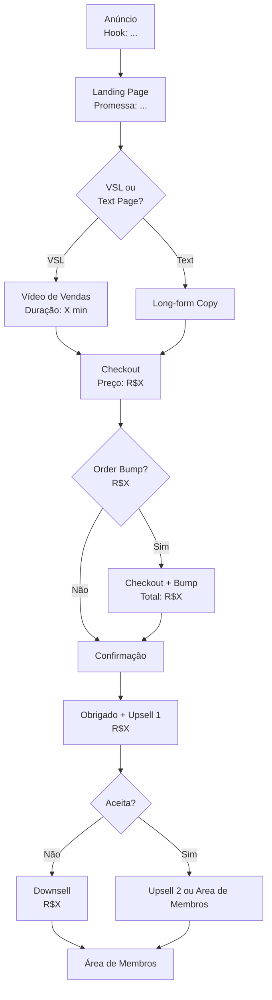

# SKILL: FUNNEL HACKING SUPREMO (V2.0) — MODO ESPIONAGEM TÉCNICA AVANÇADA

## VISÃO GERAL

Esta skill é o modo de espionagem profunda do ecossistema. Diferente do Funnel Hacker V4.0 (que faz análise estratégica e de posicionamento), o Funnel Hacking Supremo executa a engenharia reversa técnica completa de funis de concorrentes: encontra páginas ocultas, mapeia fluxos de checkout, transcreve VSLs, analisa estrutura de anúncios e produz diagramas Mermaid do funil completo.

**Use quando:** Precisar ir além da análise estratégica e quiser reconstruir tecnicamente como o funil do concorrente funciona de ponta a ponta.

---

## GATILHO DE ATIVAÇÃO

O usuário fornecerá: `[Nome do concorrente]` e/ou `[URL]` e/ou `[Nicho]`.

**REGRA MANDATÓRIA:** Usar `web_search` em cada passo com termos específicos. Documentar cada dado encontrado com a fonte. Nunca assumir estrutura sem evidência — buscar sempre.

---

## PROTOCOLO DE 7 OBJETIVOS

---

### OBJETIVO 1 — DESCOBERTA (The Hunt)

**1.1 — Google Dorks para páginas ocultas:**

Buscar páginas de checkout, confirmação e VSL que não aparecem no menu:

```
Dorks principais:
site:[dominio.com] inurl:checkout
site:[dominio.com] inurl:obrigado OR inurl:thanks
site:[dominio.com] inurl:vsl OR inurl:video
site:[dominio.com] inurl:upsell OR inurl:oferta
site:[dominio.com] inurl:trial OR inurl:acesso

Para plataformas brasileiras:
site:hotmart.com "[Nome do Produto]"
site:kiwify.com.br "[Nome do Produto]"
site:eduzz.com "[Nome do Produto]"
site:monetizze.com.br "[Nome do Produto]"
site:pay.hotmart.com "[Nome Produtor]"
```

**1.2 — Busca por variações de domínio:**
```
"[nome do produto]" site:.com.br
"[nome do produtor]" inurl:lp OR inurl:vendas OR inurl:oferta
"[nome do produto]" filetype:pdf (para materiais gratuitos/lead magnets)
```

**1.3 — Busca por anúncios ativos:**
- Meta Ad Library: `https://www.facebook.com/ads/library/?q=[nome]`
- Google Ads Transparency Center: `https://adstransparency.google.com/`
- TikTok Creative Center (se aplicável)

**Output esperado:**
```
PÁGINAS ENCONTRADAS:
- [URL 1]: [tipo de página] — [data de descoberta]
- [URL 2]: [tipo de página]
[continuar para todas encontradas]
```

---

### OBJETIVO 2 — VALIDAÇÃO DE ESCALA (The Score)

**Score de Escala (1-10) para cada concorrente:**

| Indicador | Como verificar | Peso |
|-----------|----------------|------|
| Tempo do anúncio ativo | Meta Ad Library — data de início | Alto |
| Volume estimado de tráfego | SimilarWeb.com, Semrush | Alto |
| Presença em múltiplos canais | Quantas plataformas de anúncio | Médio |
| Quantidade de reviews | Reclame Aqui, Trustpilot, Google | Médio |
| Variedade de criativos | Quantos anúncios diferentes rodando | Médio |

**Calcular Score:** Somar indicadores normalizados (1-2 pts cada) = Score 1-10.

**Regra:** Score 7+ = funil validado em escala. Estudar profundamente. Score abaixo de 4 = funil experimental. Estudar como anti-exemplo.

---

### OBJETIVO 3 — DOSSIÊ PROFUNDO (The Biopsy)

Para cada página encontrada no Objetivo 1, documentar:

**Landing Page / Página de Vendas:**
```
HEADLINE PRINCIPAL: [texto exato]
SUBHEADLINE: [texto exato]
PROMESSA CENTRAL (em uma frase): [síntese]
MECANISMO ÚNICO DELES: [como explicam por que funciona]
HOOK DE ABERTURA (se VSL): [primeiros 30 segundos]
PREÇO(S): [listados na página]
GARANTIA: [prazo + condições]
BÔNUS LISTADOS: [nome + valor atribuído]
CTA PRINCIPAL: [texto do botão]
ELEMENTOS DE PROVA SOCIAL: [tipos + quantidade]
URGÊNCIA/ESCASSEZ USADA: [tipo + razão declarada]
```

**Página de Checkout:**
```
PRICE POINTS OFERECIDOS: [lista]
ORDER BUMP PRESENTE: [sim/não + texto]
UPSELL PÓS-CHECKOUT: [sim/não + tipo]
CAMPOS OBRIGATÓRIOS: [quais dados pede]
MEIOS DE PAGAMENTO: [cartão/pix/boleto/parcelamento]
```

---

### OBJETIVO 4 — MAPEAMENTO DE FLUXO (The Flow)

**Construir o diagrama completo do funil em Mermaid:**



*Adaptar o diagrama ao funil real encontrado.*

**Documentar em texto também:**
```
FLUXO DO FUNIL [Nome Concorrente]:
Anúncio ([plataforma]) →
LP ([URL]) →
[VSL/Copy] ([duração/tipo]) →
Checkout ([preço]) →
[Order Bump: sim/não, R$X] →
Obrigado + Upsell 1 ([preço]) →
[Aceita: Upsell 2 / Recusa: Downsell] →
Área de Membros
```

---

### OBJETIVO 5 — ENGENHARIA REVERSA DE COPY (The ANAMS Reverse)

**5.1 — Transcrição de VSL (quando disponível):**
Buscar transcrições em:
- YouTube (legendas automáticas)
- `site:rev.com "[nome do produto]"`
- Comentários que citam frases da VSL
- Fóruns e grupos do nicho

**5.2 — Análise estrutural da VSL:**

| Bloco | Início | Conteúdo | Técnica usada |
|-------|--------|----------|---------------|
| Hook | 0:00 | [texto] | [Curiosidade/Contraste/Identificação] |
| Problema | X:XX | [texto] | [Espelho/Agitação] |
| Villain | X:XX | [quem é o vilão] | [Conspiração/Injustiça] |
| Mecanismo | X:XX | [como explica] | [Revelação/Parábola] |
| Prova | X:XX | [tipo de prova] | [Social/Lógica/Autoridade] |
| Oferta | X:XX | [o que oferece] | [Empilhamento/Hormozi] |
| Urgência | X:XX | [tipo] | [Real/Artificial] |
| CTA | X:XX | [texto] | [Identidade/Direto] |

**5.3 — Promessa Central:**
Em uma frase: o que o concorrente promete acima do fold?

**5.4 — Provas Sociais Usadas:**
- Quantidade e tipo (vídeo/texto/screenshot/número)
- Perfil dos depoentes
- Resultados citados (com ou sem aviso de resultados típicos)

---

### OBJETIVO 6 — IDENTIFICAÇÃO DE BRECHAS (The Gap)

**6.1 — Análise de Reviews Negativos:**

Buscar em:
- Reclame Aqui: `reclameaqui.com.br [nome do produto]`
- Trustpilot: `trustpilot.com [nome]`
- YouTube comentários: buscar "[nome do produto] funciona?"
- Grupos do Facebook: `"[nome do produto]" -site:facebook.com` (ver resultados indexados)

**Padrão de reclamação (Template):**

| Categoria de Reclamação | Frequência | Gravidade | Oportunidade para nós |
|-------------------------|------------|-----------|----------------------|
| Suporte inexistente | Alta | Média | Oferecer suporte premium |
| Promessa vs. entrega | Alta | Alta | Garantia mais forte |
| Complexidade do método | Média | Média | Simplificação |
| Sem resultados em [nicho] | Média | Alta | Foco em nicho específico |

**6.2 — Os Pontos Cegos:**
O que o concorrente ignora sistematicamente que nosso produto atende?

**6.3 — Ângulo de Contra-Ataque:**
Como posicionar para fazer o concorrente parecer:

```
"[Concorrente X] ensina [técnica], mas ignora completamente [ponto cego].
É por isso que [resultado frustrante típico dos clientes deles].
[Nosso produto] resolve exatamente [o que eles ignoram] através de [mecanismo]."
```

---

### OBJETIVO 7 — PERSISTÊNCIA E RETOMADA

**7.1 — Estrutura de arquivos para salvar a pesquisa:**

```
funnel-hacking/
├── [concorrente-nome]/
│   ├── _estado.md (próximo passo, data da última atualização)
│   ├── urls-encontradas.md
│   ├── dossiê-LP.md
│   ├── dossiê-checkout.md
│   ├── transcrição-VSL.md
│   ├── reviews-negativos.md
│   ├── diagrama-funil.mermaid
│   └── brechas-identificadas.md
```

**7.2 — Template `_estado.md`:**
```
# Estado da Pesquisa — [Nome Concorrente]
Última atualização: [data]
Score de Escala: [X/10]
Status: [Em andamento / Completo]
Próximo passo: [Objetivo N — O que falta fazer]
Prioridade: [Alta/Média/Baixa]
Notas: [observações relevantes]
```

---

## FORMATO DE SAÍDA: RELATÓRIO TÉCNICO COMPLETO

### 1. PÁGINAS ENCONTRADAS
Lista de todas as URLs com tipo e data.

### 2. SCORE DE ESCALA
Tabela de indicadores + score final por concorrente.

### 3. DOSSIÊ PROFUNDO
Formulário completo por LP + Checkout.

### 4. DIAGRAMA DO FUNIL
Código Mermaid + descrição textual do fluxo.

### 5. ANÁLISE DE VSL/COPY
Tabela de blocos + Promessa Central + Provas Sociais.

### 6. RELATÓRIO DE BRECHAS
Padrões de reclamação + Pontos Cegos + Ângulo de Contra-Ataque.

### 7. OPORTUNIDADES ESTRATÉGICAS
3 insights prioritários para usar no posicionamento da oferta.

---

## PROTOCOLO DE HANDOFF (MANDATÓRIO)

1. **Score de Escala do Concorrente Principal:** Validado ou não.
2. **Brecha Fatal #1:** A maior oportunidade não explorada pelo concorrente.
3. **Ângulo de Contra-Ataque:** Frase pronta para usar em copy.
4. **Sugestão de Ação Imediata:** `"Ative o REPOSICIONAMENTO ESTRATÉGICO V2.0 usando as brechas encontradas"` ou `"Ative a SKILL-DEVASTADOR V4.0 com o Relatório de Reconhecimento completo"`.
5. **Transferência de Contexto:** Diagrama do funil + Dossiê de LP + Padrões de reclamação + Ângulo de contra-ataque.

---

*Fim do Protocolo Funnel Hacking Supremo V2.0 — Modo Espionagem Técnica Avançada*
